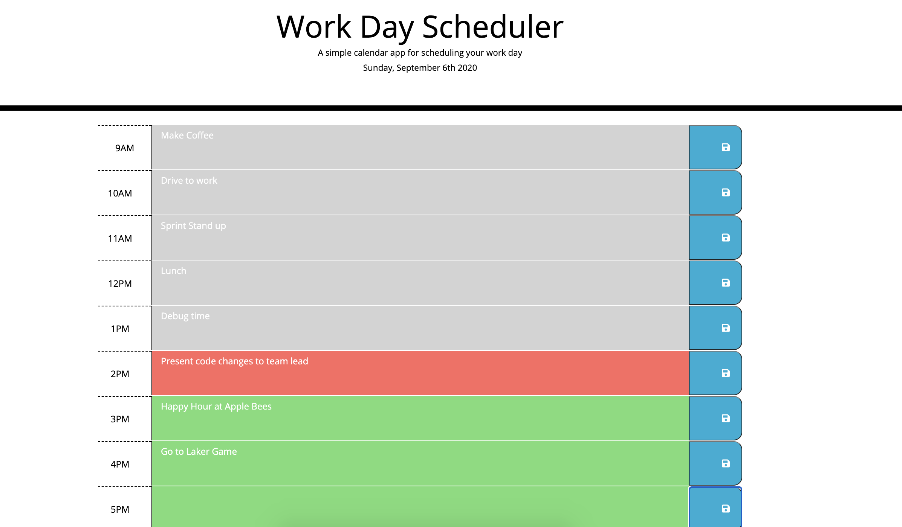

# Work Day Scheduler

Installation:

Go to the following link to take The Code Quiz:
(https://ginomaglaqueucla.github.io/work-day-scheduler-gm20/)

If accessing locally, clone repository from (https://github.com/ginomaglaqueucla/work-day-scheduler-gm20.git) to local directory on computer. Open index.html through your browser and site will come up.

Usage:

Work Day Scheduler is a simple calendar application that allows a user to save events for each hour of the day.

Features:
    - User inputs/edit events in specific hourly timeslots
    - Ability to save events, brower will load from local storage
    - Color identifier for past, present, and/or future events 
    - Application will recheck time stamps every minute to ensure user is presented with the most up to date information regarding event dues

Usage (Screenshots):
Main Page

Credits Changes/Commits by: ginomaglaqueucla - (https://github.com/ginomaglaqueucla/code-quiz-gm20.git)

Application uses the following libraries:
- Starter code from: (https://github.com/coding-boot-camp/super-disco.git)
- Bootstrap
- Font Awesome
- Google Fonts
- JQuery
- Moment

License MIT License

Copyright (c) 2020 Gino Maglaque

Permission is hereby granted, free of charge, to any person obtaining a copy of this software and associated documentation files (the "Software"), to deal in the Software without restriction, including without limitation the rights to use, copy, modify, merge, publish, distribute, sublicense, and/or sell copies of the Software, and to permit persons to whom the Software is furnished to do so, subject to the following conditions:

The above copyright notice and this permission notice shall be included in all copies or substantial portions of the Software.

THE SOFTWARE IS PROVIDED "AS IS", WITHOUT WARRANTY OF ANY KIND, EXPRESS OR IMPLIED, INCLUDING BUT NOT LIMITED TO THE WARRANTIES OF MERCHANTABILITY, FITNESS FOR A PARTICULAR PURPOSE AND NONINFRINGEMENT. IN NO EVENT SHALL THE AUTHORS OR COPYRIGHT HOLDERS BE LIABLE FOR ANY CLAIM, DAMAGES OR OTHER LIABILITY, WHETHER IN AN ACTION OF CONTRACT, TORT OR OTHERWISE, ARISING FROM, OUT OF OR IN CONNECTION WITH THE SOFTWARE OR THE USE OR OTHER DEALINGS IN THE SOFTWARE.